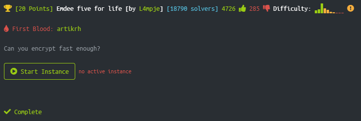

# Emdee-HTB
## Simple bot for completing the Emdee challenge on Hack The Box

Below is the landing page of the target IP. It is a very simple site that generates a random string that needed to be encrypted using md5 encryption and sent back to the server in a amount of time that isn't specified apart from saying *fast enough* in the challenge description.

The first thing I did was md5 hash the string and send it back to the server through the input window so I could analyse the output expecting a failure message otherwise it wouldn't be a challenge.

I thought of a few ideas I could use to get the flag:
- Run an sqlmap on the php page to see if it is vulnerable to an sql injection
- Analising the packets sent and recieved to see if I could get lucky and modify a parameter to do with time however the only parameter sent was the hash as well as the session id, meaning the time is based on the server's clock which I was expecting

However I already had an idea on how the challenge was supposed to be beat so I set out on creating a bot in python3. The [bot](https://github.com/JacobAndrewRandall/Emdee-HTB/blob/main/main.py) is fairly simple it creates a session and requests the page from the server then if it recieves a success code it takes the phrase and encrypts it then sends the phrase back to the server and sends the return webpage in my python console.

